# 内容
## 选择器
- class用.，id用#，普通标签直接写，多个标签用逗号隔开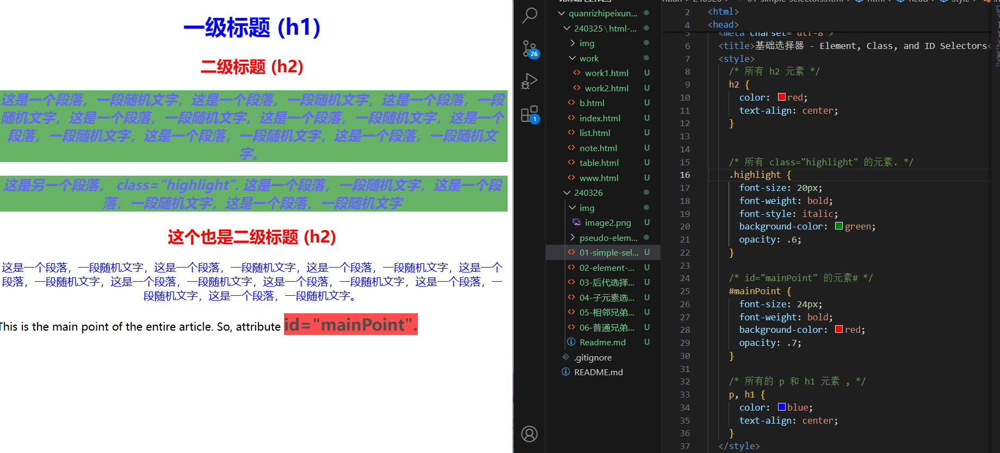
- 要选中某个标签中的某个class，如h1的class，用h1.class表示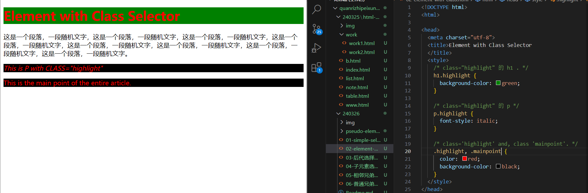
- 后代选择器，要精确控制的话，父级选择器后空格接上子级，如 ul空格li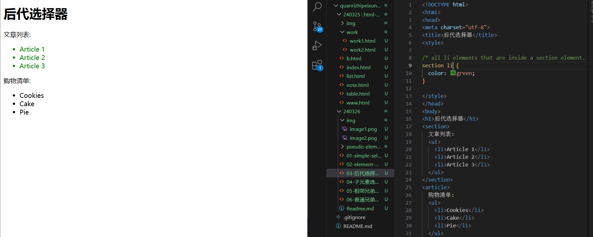
- 子元素选择器，中间没有隔着别的层级，要精确控制，用>连接，如ul>li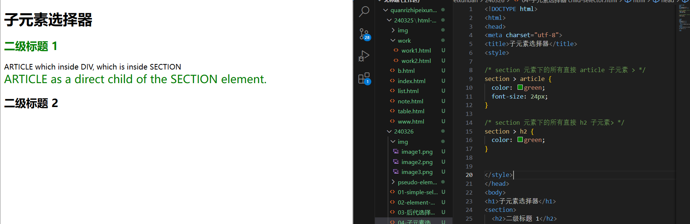
- 相邻兄弟选择器，用+连接，会选中后面相邻的兄弟，如#d+div，会选中id=d的元素相邻的div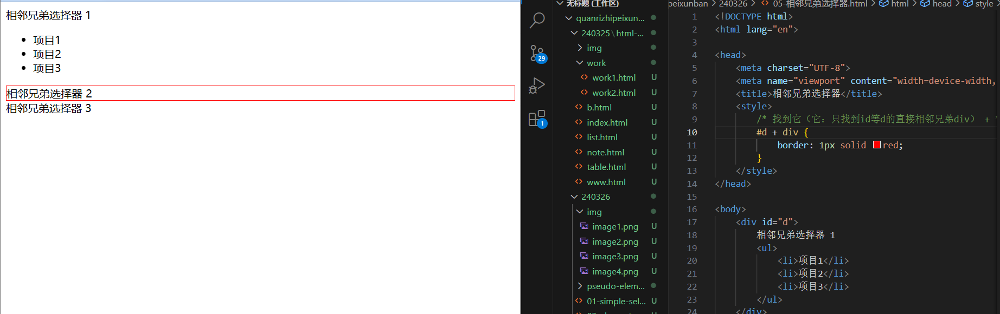
- 普通兄弟选择器，会选中后面的所有普通兄弟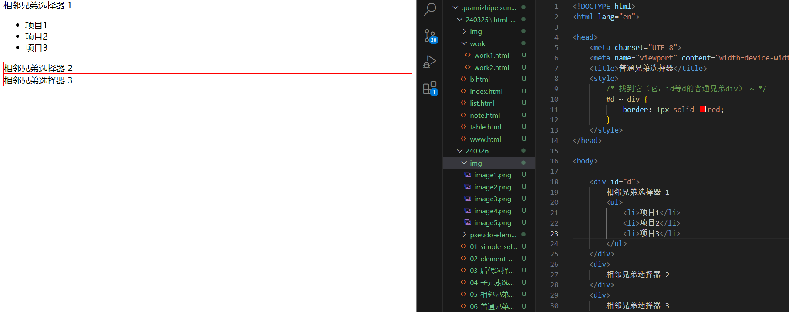
## 伪元素
用双冒号表示
- p::first-letter,选中第一个字母进行控制
- p::first-line,选中第一行进行控制，第一行会随着窗口的大小改变，改变后会重新渲染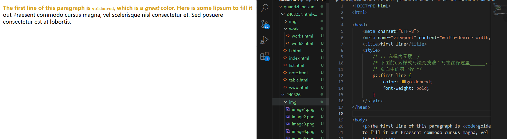
- ::marker,列表的标记框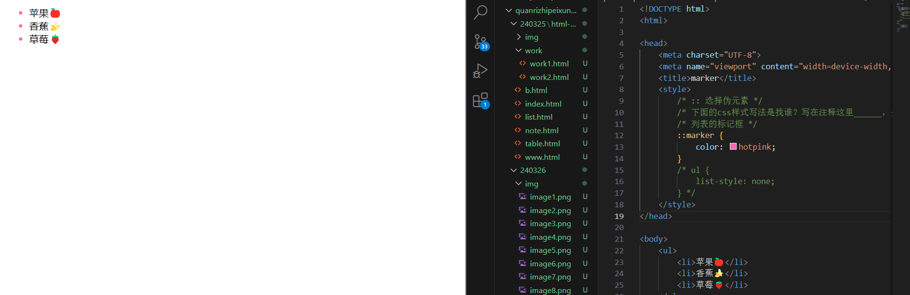
- ::selection,所选中的文本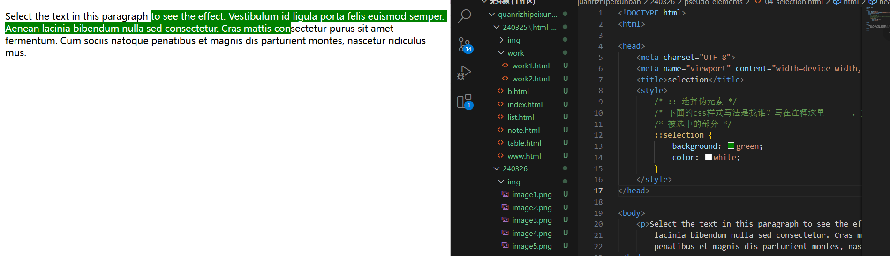
- p:nth-of-type(2)::selection,第二段被选中的部分，nth-of-type是指同类型标签的位置，前面的p让他精确到p标签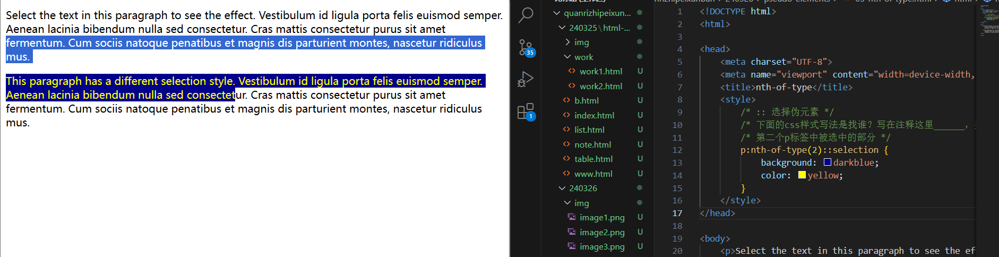
- ::placeholder,选中input输入框的placeholder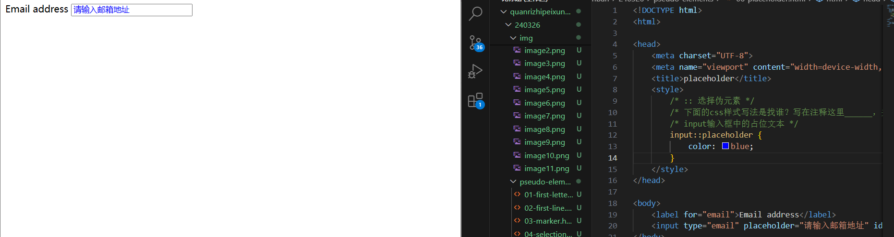