# 
内容

## 
CSS转换

- transform：translateX/Y/Z() 平移

- transform：rotateX/Y/Z() 旋转

## 
CSS过渡

- transition 变化在规定时间完成

## 
CSS动画
- animation-name 动画的名字，只是为了找到它

- animation-duration 变化的时间

- animation-delay 延迟变化

- @keyframes 关键帧，其中的内容就是动画的变化过程

        练习 动态时钟；应用已经写好的动画到自己的页面中
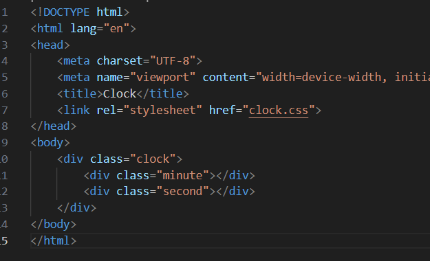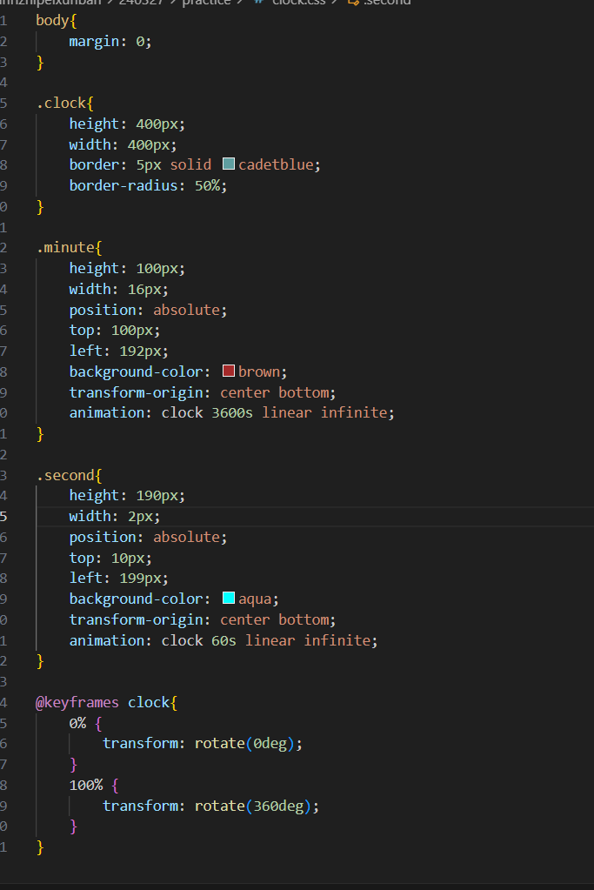

动态时钟比较关键的点：

    分针秒针需要用绝对定位改变位置，需要用transform-origin改变基准点，用transform：rotate控制旋转，animation：clock 60s linear infinite，调用clock动画，60s完成，线性速度，无限次调用

应用已经写好的animate.css：

    引用了css后，记得在想要的样式前面还要加上animate__animated
    
---

## flex弹性布局

采用flex布局的元素，称之为容器，容器内的子元素称之为项目
有主轴和交叉轴
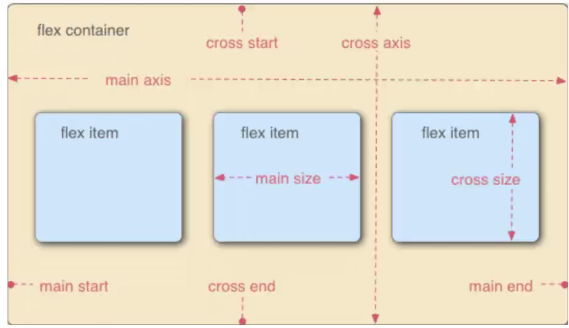

### flex-direction
row/row-reverse/column/column-reverse 更改布局的方向

### flex-wrap
wrap(换行)/nowrap(默认值，不换行)/wrap-reverse(换行，第一行在下面)

### justify-content 
调整主轴的对齐方式

space-evenly是均匀分布
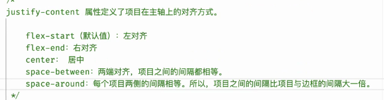

### align-item 
调整交叉轴的对齐方式
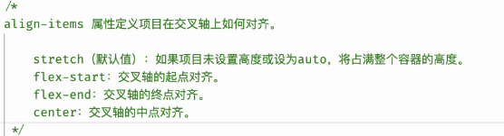

### order 
调整排序方式，数值越小越靠前，数值要求整数
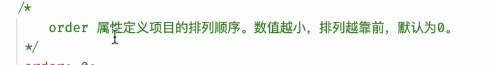

### flex-grow（0-∞）
放大比例，默认为0，即有剩余空间也不占满，数值要求非负数，剩余空间由非零的元素按比例分配，加到原来的元素上，如果非零元素加起来小于1，也会占不满
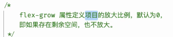
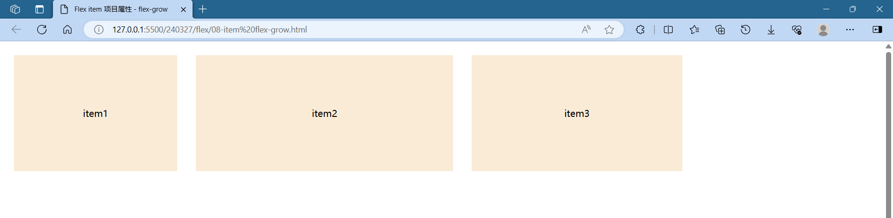

### flex-shrink
缩小比例，默认为1，空间不足会进行缩小，改为0就不会变小，数值要求非负数，空间缩小后，不为0的元素会用值*宽度获得总权重，再按照权重将应缩减的空间进行分配，从原来的元素上减去，同样，非零元素加起来小于1，也不会全部收缩
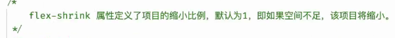
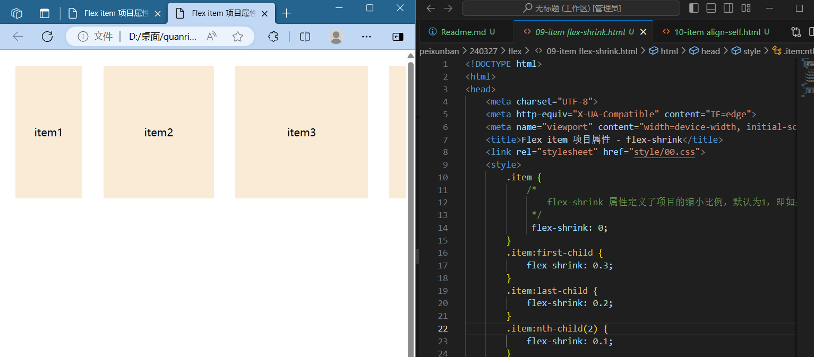

### align-self
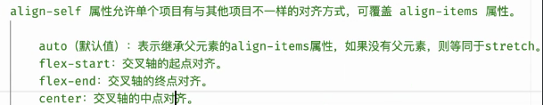